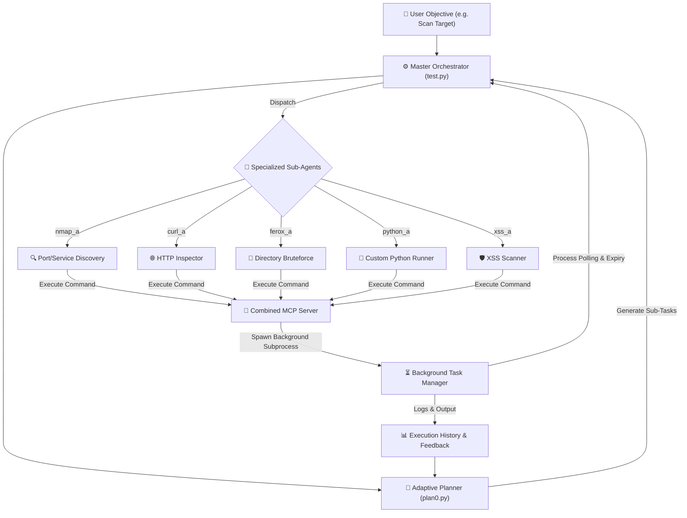

# ⚡ Cyberstrike v2: Automated WAPT Orchestrator

**Cyberstrike v2** is a modular, multi-agent Web Application Penetration Testing (WAPT) framework built on the **LangChain / LangGraph** ecosystem. It automates security assessments by replacing rigid, linear pentesting scripts with an intelligent **plan-execute-feedback** orchestration loop.

---

## Introduction

Welcome to arv's chaotic space for cyberstrike-v2

This repo is a hobby project of mine, which I've been working for past few month.

It basically a automated WAPT framework, uses langchain ecosystem and some custom functions

It's currently a work in progress so just wait okay?

## 🏗️ System Architecture

The core architecture operates as an iterative feedback loop where the planner makes decisions based on real-time tool outputs and background task states.



---

## 🔥 Key Features & Capabilities

### 1. Adaptive Iterative Orchestrator (`test.py` & `plan0.py`)
* **Plan-Execute-Replan Loop:** Instead of relying on predefined scanning templates, Cyberstrike v2 dynamically generates, executes, and revises plans based on actual outcomes.
* **Dual State Tracking:** The master loop keeps a detailed execution history of `Task ➔ Result` and dynamically feeds it to the planner to avoid task duplication or dead ends.
* **Structured Output Validation:** Leveraging standard Pydantic schemas (`Task`, `Plan`), LLM outputs are guaranteed to be syntactically valid and reliable.

### 2. Specialized Multi-Agent Swarm (`prototype/sub_agents/`)
Cyberstrike distributes tasks among specialized sub-agents, each acting as a focused workflow model:
* **`nmap_a` (Discovery):** Handles network reconnaissance, host discovery, and port scanning. Starts with light sweeps and escalates based on findings.
* **`curl_a` (HTTP Analysis):** Inspects raw web servers, handles browser headers mimicking real agents to bypass simple bot detection, and maps web endpoints.
* **`ferox_a` (Directory Bruteforcing):** Performs robust directory/file enumeration using Feroxbuster on confirmed web targets.
* **`python_a` (Script Runner):** Writes and executes standard Python scripts to parse data, transform payloads, or perform mathematical validations.
* **`xss_a` (Vulnerability Tester):** Validates and verifies Cross-Site Scripting (XSS) issues specifically target-focused on identified input fields.

### 3. Asynchronous Background Task Manager (`background_tasks.py`)
To handle long-running WAPT commands (like comprehensive Nmap scans or intensive directory brute-forcing) without blocking the master agent execution:
* **Session-Isolated Execution:** Spawns asynchronous processes in separate sessions (`start_new_session=True`).
* **File-Locked Persistence:** Uses low-overhead, file-system-level concurrency locks (`fcntl`) to track background jobs in a central metadata repository (`tasks_metadata.json`).
* **Active Lifespan Management:** 
  * Automatically terminates hung or prolonged tasks exceeding their configured `max_runtime` using process group SIGKILL.
  * Real-time polling (`wait_for_task_completion`) checks process status via quick `os.kill(pid, 0)` signals.
* **Auto-Cleanup Engine:** Cleans up historical task logs and raw command logs periodically to manage disk space.

### 4. Model Context Protocol (MCP) Server integration
* Exposes system tools directly to the LangGraph sub-agents using standard MCP interfaces (`curl_mcp_server.py`, `nmap_mcp_server.py`, etc.).
* Implements robust security command validation blocks (`validators.py`) to prevent destructive shell injections or path traversal outside scoped boundaries.

---

## 📂 Core Directory Structure

```text
├── prototype/
│   ├── mcp_stuff/                   # Tool scripts & background execution
│   │   ├── background_tasks.py      # Background CLI process manager
│   │   ├── combined_mcp_server.py   # Multi-tool MCP endpoint
│   │   └── validators.py            # Command and path safety validator
│   │
│   └── sub_agents/                  # Autonomous sub-agent LangGraph layers
│       ├── test.py                  # Master Orchestrator loop
│       ├── plan0.py                 # Pydantic-validated LLM Planner
│       ├── curl_graph_test_mcp.py   # Web Inspector sub-graph
│       ├── ferox_graph_test_mcp.py  # Path Bruteforcer sub-graph
│       ├── nmap_graph_test_mcp.py   # Port Discovery sub-graph
│       └── xss_graph_test_mcp.py    # XSS Validator sub-graph
│
└── app/                             # Shared utilities, services, logging
```
