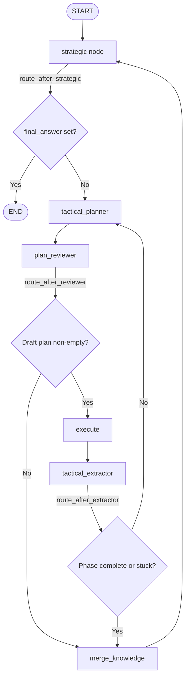

# Cyberstrike v2: Automated WAPT Orchestrator

Cyberstrike v2 is a modular, multi-agent Web Application Penetration Testing (WAPT) framework built on LangChain and LangGraph. It automates security assessments using an iterative strategic-tactical loop with parallel task execution, metadata-driven coverage gating, and strict plan reviewing.

---

## Architectural Overview & Design Philosophy

The orchestration architecture of Cyberstrike v2 decouples high-level strategic reasoning from low-level tool execution and validation. This is achieved via a multi-layered agent model orchestrated by LangGraph:

1. **Phase-Based Progression**: The pentest executes across three consolidated phases defined in [schemas.py](file:///d:/Temp/langchain-academy/prototype/sub_agents/schemas.py): `recon` ➔ `attack_analysis` ➔ `reporting`.
2. **Cognitive Task Separation**: Separation of concerns is enforced between planners, extractors, and executors. For instance, the tactical layer is split into distinct planning and extraction nodes so the planning model is not polluted with raw tool parser output.
3. **Parallel Dependency-Aware Execution**: Independent tasks are batched and executed concurrently to optimize time, respecting strict dependency constraints.
4. **Constrained Plan Reviewing**: A dedicated Plan Reviewer runs after the tactical planner to inspect plans in-place (strictly limited to delete, append-by-coverage, and reorder operations), with a programmatic block on task description rewriting.
5. **Evolved Target Knowledge & Coverage Matrix**: Uses dictionary structures for ports, services, endpoints, inputs, findings, background tasks, and exploit intelligence. Progression is tracked deterministically via a dynamic coverage matrix.
6. **Execution Metrics**: Captures and prints metrics (cycles, coverage, reviewer edits, duplicate prevention, strategic calls, exploit intel lookups) at the end of each run to identify bottleneck components.

---

## StateGraph Flow and Lifecycle

The orchestration lifecycle is managed in [master_graph.py](file:///d:/Temp/langchain-academy/prototype/sub_agents/master_graph.py). Below is the precise node execution and conditional routing flow:



### Flow Walkthrough

1. **Strategic Selection**: [strategic_planner](file:///d:/Temp/langchain-academy/prototype/sub_agents/strategic_planner_module.py) evaluates the overall knowledge graph and sets the `current_phase` and `phase_objective` (planning goal). If reporting has finished, the graph routes to `END`.
2. **Tactical Planning**: [tactical_planner](file:///d:/Temp/langchain-academy/prototype/sub_agents/tactical_planner_module.py) consumes the planning goal, previous execution history, and target knowledge to generate a batch of ready-to-run tasks. It automatically injects exploit intelligence and CVE verification tasks while filtering out duplicate tasks.
3. **Plan Reviewing**: [plan_reviewer](file:///d:/Temp/langchain-academy/prototype/sub_agents/plan_reviewer.py) inspects the draft plan, stripping illegal active checks in the recon phase, sorting tasks by priority, and appending tasks mapped directly to uncovered coverage entries.
4. **Execution**: [execute_plan](file:///d:/Temp/langchain-academy/prototype/sub_agents/executor.py) runs the approved tasks concurrently via specialized sub-agents.
5. **Structured Extraction**: [tactical_extractor](file:///d:/Temp/langchain-academy/prototype/sub_agents/tactical_planner_module.py) processes raw execution output, extracting *only new* findings to avoid duplicating existing knowledge. It marks coverage checks completed for successful tasks and dynamically registers new attack surface checks.
6. **Merging & Stuck Checking**: If a cycle has no meaningful growth, the `stuck_cycle_count` is incremented. When all coverage is completed or `stuck_cycle_count >= 3`, [merge_knowledge_node](file:///d:/Temp/langchain-academy/prototype/sub_agents/master_graph.py) commits the buffered findings into the master `knowledge` base and returns to the strategic planner to transition phases.

---

## Core Components and Modules

### 1. Master State & Knowledge Graph
- **State Definition**: The orchestrator State is defined by [MasterState](file:///d:/Temp/langchain-academy/prototype/sub_agents/schemas.py) in [schemas.py](file:///d:/Temp/langchain-academy/prototype/sub_agents/schemas.py). It aggregates query data, current phase statistics, execution history, plan tasks, metrics, and accumulated findings.
- **Knowledge Schema**: [TargetKnowledge](file:///d:/Temp/langchain-academy/prototype/sub_agents/schemas.py) models structured target data:
  - `ports`: Evolved dictionary mapping port numbers to service details.
  - `services`: Tech stacks and fingerprinted versions.
  - `endpoints_dict`: Discovered URLs mapped to status and method constraints.
  - `inputs`: Discovered input fields, forms, and parameter types.
  - `exploit_intelligence`: Evolved tech-to-CVE/PoC lookup results.
  - `findings_dict`: Tracked and confirmed vulnerabilities.
  - `background_tasks`: Map of running/completed processes.
  - `coverage`: Evolved dynamic matrix mapping phases to check states.
  - Deduping is managed in [merge_knowledge](file:///d:/Temp/langchain-academy/prototype/sub_agents/schemas.py).

### 2. Strategic Planner
Implemented in [strategic_planner_module.py](file:///d:/Temp/langchain-academy/prototype/sub_agents/strategic_planner_module.py).
- **Function**: [strategic_planner](file:///d:/Temp/langchain-academy/prototype/sub_agents/strategic_planner_module.py)
- **Role**: Evaluates the global target knowledge and directs the orchestrator to transition, loop back, skip, or stay in a phase.
- **Reporting**: In the `reporting` phase, synthesizes all accumulated findings into a structured, executive-ready Penetration Test Report Markdown artifact.

### 3. Tactical Layer (Planner & Extractor)
Implemented in [tactical_planner_module.py](file:///d:/Temp/langchain-academy/prototype/sub_agents/tactical_planner_module.py).
- **Separation of Concerns**: Split into [tactical_extractor](file:///d:/Temp/langchain-academy/prototype/sub_agents/tactical_planner_module.py) (extraction only) and [tactical_planner](file:///d:/Temp/langchain-academy/prototype/sub_agents/tactical_planner_module.py) (planning only).
- **Phase Playbooks**: Enforces strictly defined phase behaviors:
  - `recon`: Passive discovery of ports, services, endpoints, JS, APIs, forms, and parameters. Strictly forbids active injection/vuln testing.
  - `attack_analysis`: Probing and validation using passive or active techniques (XSS, SQLi, IDOR, auth, headers, CVEs, PoCs).
- **Dependency Chains**: Outputs [Task](file:///d:/Temp/langchain-academy/prototype/sub_agents/schemas.py) models with `task_id`, `depends_on`, and satisfy-targeting `coverage_keys` lists.

### 4. Plan Reviewer
Implemented in [plan_reviewer.py](file:///d:/Temp/langchain-academy/prototype/sub_agents/plan_reviewer.py).
- **Function**: [plan_reviewer](file:///d:/Temp/langchain-academy/prototype/sub_agents/plan_reviewer.py)
- **Role**: Validates the draft plan generated by the tactical planner in-place. Strips illegal active checks during the recon phase, sorts tasks by priority, and appends coverage checks. Description edits are programmatically blocked in Python to prevent hallucinated changes.

### 5. Parallel Executor
Implemented in [executor.py](file:///d:/Temp/langchain-academy/prototype/sub_agents/executor.py).
- **Function**: [execute_plan](file:///d:/Temp/langchain-academy/prototype/sub_agents/executor.py)
- **Role**: Evaluates the plan, determines tasks with satisfied dependencies (the "ready" layer), and launches them concurrently using `asyncio.gather`. Adds `status` tracking (`SUCCESS` / `FAILED`) to results.

---

## Sub-Agent Subgraphs

Specialized agent graphs are defined under [prototype/sub_agents/](file:///d:/Temp/langchain-academy/prototype/sub_agents/):

- **nmap_a** ([nmap_graph_test_mcp.py](file:///d:/Temp/langchain-academy/prototype/sub_agents/nmap_graph_test_mcp.py)): Orchestrates port discovery, OS fingerprinting, and service detection.
- **http_a** ([http_graph.py](file:///d:/Temp/langchain-academy/prototype/sub_agents/http_graph.py)): Handles complex HTTP requests using custom presets, redirects, and headers.
- **ferox_a** ([ferox_graph_test_mcp.py](file:///d:/Temp/langchain-academy/prototype/sub_agents/ferox_graph_test_mcp.py)): Brute-forces directories and files using wordlists.
- **python_a** ([python_req_graph_test_mcp.py](file:///d:/Temp/langchain-academy/prototype/sub_agents/python_req_graph_test_mcp.py)): Compiles and runs custom Python scripts to test custom/complex vectors.
- **xss_a** ([xss_graph_test_mcp.py](file:///d:/Temp/langchain-academy/prototype/sub_agents/xss_graph_test_mcp.py)): Probes for Cross-Site Scripting (XSS) injection.
- **intel_a** ([exploit_intel_graph.py](file:///d:/Temp/langchain-academy/prototype/sub_agents/exploit_intel_graph.py)): Searches databases and search engines for known PoCs and vulnerabilities. Uses helper APIs defined in [tools.py](file:///d:/Temp/langchain-academy/prototype/sub_agents/tools.py) (NVD API, Tavily, GitHub API).

---

## Model Context Protocol (MCP) Tool Integration

The framework leverages MCP to execute low-level operating system commands and tools in a safe, decoupled environment.

### MCP Server
Defined in [combined_mcp_server.py](file:///d:/Temp/langchain-academy/prototype/mcp_stuff/combined_mcp_server.py).
- Starts a FastMCP server running over Streamable HTTP on port 4545.
- Exposes tools like:
  - `basic_scan`, `aggressive_scan`, `noping_version_scan`, `script_scan` (wrapping nmap)
  - `http_request` (wrapping httpx)
  - `dalfox_basic_scan` (wrapping DalFox XSS scanner)
  - `xsstrike_basic_scan` (wrapping XSStrike XSS scanner)
  - `start_nmap_long_scan`, `start_feroxbuster` (wrapping background execution)
  - `exe_cute_python` (wrapping isolated python code runner)
  - `searchsploit_search` (wrapping ExploitDB search)

### Security Gating & Sanitization
Defined in [validators.py](file:///d:/Temp/langchain-academy/prototype/mcp_stuff/validators.py).
- The function [validate_command](file:///d:/Temp/langchain-academy/prototype/mcp_stuff/validators.py) serves as a gate for command validation.
- Sanitizes targets, URLs, port ranges, and checks for shell chaining and command injection vectors via regexes and blacklist checks.

### Background Task Management
Defined in [background_tasks.py](file:///d:/Temp/langchain-academy/prototype/mcp_stuff/background_tasks.py).
- Manages long-running processes (e.g. feroxbuster, port scans) asynchronously.
- Exposes task status check and output acquisition interfaces.

---

## Directory Structure

```text
├── prototype/
│   ├── mcp_stuff/                           # MCP server tool wrapper actions
│   │   ├── background_tasks.py              # Asynchronous background process manager
│   │   ├── combined_mcp_server.py           # Startable FastMCP Streamable-HTTP tool server
│   │   ├── validators.py                    # Input command sanitation and safety validators
│   │   ├── kali_command.py                  # Direct OS command runner helper
│   │   ├── helper.py                        # MCP helpers
│   │   └── *_actions.py                     # Tool specific actions (nmap, HTTP, XSS, feroxbuster, etc.)
│   │
│   └── sub_agents/                          # Multi-agent orchestrator graphs
│       ├── master_graph.py                  # Core LangGraph orchestration & lifecycle loops
│       ├── strategic_planner_module.py      # High-level phase progression & reporting manager
│       ├── tactical_planner_module.py       # Separated planner and extractor logic
│       ├── plan_reviewer.py                 # Strict plan reviewer validator
│       ├── executor.py                      # Parallel task scheduler and dependency resolver
│       ├── schemas.py                       # Master and tactical schemas, Coverage matrix definitions
│       ├── tools.py                         # Sub-agent helper tools (NVD, GitHub PoC, Tavily search)
│       ├── schema_validator.py              # Pydantic LLM output shape validator
│       ├── true_mcp_exec.py                 # Streamable HTTP MCP client execution layer
│       ├── prompt.py                        # Common prompts for sub-agent graphs
│       └── *_graph.py / *_graph_test_mcp.py # Individual agent subgraphs (nmap, HTTP, XSS, etc.)
│
│── app/                                     # Configuration, shared utilities, logging and constants
```

---

## Getting Started

### Prerequisites

1. Install system dependencies (e.g., `nmap`, `feroxbuster`, `dalfox`, `xsstrike` must be installed on the host OS / Kali instance).
2. Install Python packages:
   ```bash
   pip install -r requirements.txt
   ```
3. Set up environment variables in a `.env` file in the workspace root:
   ```env
   TAVILY_API_KEY=your_tavily_key
   MCP_BASE_URL=http://localhost:4545/mcp
   ```

### Execution Steps

1. **Start the MCP Tool Server**:
   ```bash
   python -m prototype.mcp_stuff.combined_mcp_server
   ```
2. **Launch the WAPT Orchestrator**:
   ```bash
   python -m prototype.sub_agents.master_graph
   ```
