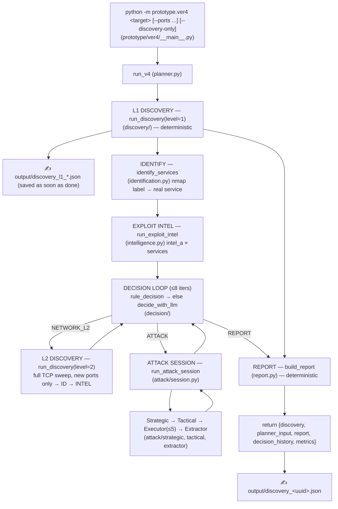

# Cyberstrike V4: Automated WAPT Orchestrator

Cyberstrike V4 is a modular, multi-agent Web Application Penetration Testing (WAPT) framework built on LangChain and LangGraph. V4 keeps the LLM for **strategic decisions only** and pushes all routine work (recon, service identification, scheduling, scoping, reporting) into **deterministic code**, so it runs fast and spends tokens only where they matter.

> The ver3 `prototype/sub_agents/` orchestration still exists, but V4 no longer uses its `master_graph`/strategic-node loop. The ver3 *agent graphs* (`http_a`, `ferox_a`, `python_a`, `xss_a`, `intel_a`, `nmap_a`) are retained and reused as the **execution workers** under V4.

---

## Architecture Overview

V4 is a linear pipeline of deterministic nodes with a single LLM-backed decision layer:



### Node responsibilities

1. **L1 Discovery** (`discovery/orchestrator.py::run_discovery(level=1)`) — deterministic recon:
   network scan (`discovery/network.py`), HTTP probe (`http.py`), content via foreground feroxbuster (`content.py`), HTML/JS extraction (`html.py`, `javascript.py`), static fingerprinting (`fingerprinting/`). Snapshot written immediately.
2. **Identification** (`identification.py::identify_services`) — resolves misleading nmap labels into real services using page content markers + headers (e.g. port 3923 labelled `rtsp` but actually `copyparty`). Writes `knowledge.services`.
3. **Exploit Intelligence** (`intelligence.py::run_exploit_intel`) — one `intel_a` per identified service (SSH excluded); `intel_a` runs `search_vulnerabilities` → `searchsploit_search` (which `cat`s the ExploitDB `.txt` PoCs) → `github_search_poc` → `nvd_lookup`, and writes an `EXPLOIT INTEL REPORT` (including **verbatim payloads**) into `knowledge.exploit_intelligence`.
4. **Decision Layer** (`decision/`) — deterministic `rule_decision` first:
   - no meaningful web surface → `NETWORK_L2` (no LLM);
   - nothing after L2 → `REPORT`;
   - otherwise the LLM (`l2_decision`) chooses `NETWORK_L2` / `ATTACK <url:port>` / `REPORT`.
   The LLM only runs when there is meaningful evidence, keeping token cost low.
5. **Attack Session** (`attack/`) — verifies known CVEs first (reusing the intel methodology/payloads), then user-requested classes, then generic checks. Strict target + agent allowlists; CVE-verify tasks are auto-injected only for the target's web stack. **Hard-stops at 2 confirmed vulnerabilities** and is bounded by empty-plan / 3 stuck cycles / 8 iterations.
6. **Report** (`report.py::build_report`) — deterministic Markdown from `DiscoveryKnowledge`.

---

## Control-flow & termination

- **Decision loop** (`planner.py::run_v4`): ≤ `MAX_DECISION_ITERATIONS = 8`; ends on `REPORT`, on a repeated decision (forced `REPORT`), or at the cap (forced report). The run always terminates with a report.
- **Attack session** (`attack/session.py::run_attack_session`): ≤ `MAX_ATTACK_SESSION_ITERATIONS = 8`; exits on empty plan, ≥ `HARD_STOP_CONFIRMED_FINDINGS = 2` confirmed vulns, ≥ `MAX_STUCK_CYCLES = 3` no-progress cycles, or the cap.
- **Sub-agents** (`sub_agents/*_graph.*`): each is a LangGraph `agent → tool → agent` loop (`helper.py::response_route`/`tool_router`) that ends when the agent emits a final message with no tool call. There is no hard step cap; the agent's LLM decides when it is done.
- **Concurrency**: the executor (`sub_agents/executor.py::execute_plan_parallel`) limits active agents to `max_concurrency = 5` via an `asyncio.Semaphore`.

---

## Execution steps

1. Start the MCP tool server (Kali host): `python -m prototype.mcp_stuff.combined_mcp_server`
2. Configure `.env`:
   ```env
   TAVILY_API_KEY=...
   GITHUB_TOKEN=...
   NVD_API_KEY=...
   MCP_BASE_URL=http://<kali-host>:4545/mcp
   ```
3. Run V4:
   ```bash
   python -m prototype.ver4 <target>                       # full: L1 + decision + attack + report
   python -m prototype.ver4 <target> --ports 3923          # add custom ports to L1
   python -m prototype.ver4 <target> --discovery-only      # L1 only, no planner/attack
   ```

---

## MCP tools (`prototype/mcp_stuff/`)

- **nmap**: `basic_scan`, `noping_version_scan`, `aggressive_scan`, `script_scan`, `start_nmap_long_scan` (background full sweep)
- **Background tasks**: `start_feroxbuster`, `get_task_output_mcp`, `get_task`, `get_all_bg_task_status`
- **HTTP**: `http_request` (GET/POST/…, presets, TLS-reverify)
- **Content / XSS**: `foreground_feroxbuster` (L1 profile), `dalfox_basic_scan`, `xsstrike_basic_scan`
- **Code exec**: `exe_cute_python`
- **Exploit intel**: `searchsploit_search` (`exploit_intel_actions.py`) and `cat` (`cat_actions.py`) — searchsploit appends the actual ExploitDB `.txt` PoC source so the intel agent gets the exact payloads.
- Commands are gated by `mcp_stuff/validators.py`.

---

## Directory structure

```text
prototype/
├── mcp_stuff/                      # MCP server + tool actions
│   ├── combined_mcp_server.py      # FastMCP Streamable-HTTP tool server
│   ├── cat_actions.py, exploit_intel_actions.py, nmap_actions.py, ...
│   └── validators.py, background_tasks.py
├── sub_agents/                     # ver3 execution workers reused by V4
│   ├── executor.py                 # parallel agent runner (≤5 concurrency)
│   └── *graph*.py / exploit_intel_graph.py   # agent graphs (http/ferox/python/xss/intel/nmap)
└── ver4/                           # V4 orchestrator (current architecture)
    ├── __main__.py                 # CLI entry
    ├── planner.py                  # run_v4 decision loop
    ├── schemas.py                  # V4 models (DiscoveryKnowledge, Task, Finding, ExploitIntel, …)
    ├── constants.py                # caps, budgets, phase prefix
    ├── identification.py           # nmap label → real service
    ├── intelligence.py             # exploit-intel scheduling + report parsing
    ├── report.py                   # deterministic report builder
    ├── decision/                   # rules.py + llm.py + prompts.py (Layer-2 decision)
    ├── discovery/                  # orchestrator (level 1/2), network/http/content/html/javascript
    ├── attack/                     # strategic, tactical, extractor, session
    ├── fingerprinting/             # nginx, wordpress, laravel, spring, openapi, graphql, generic
    ├── runtime/                    # DiscoveryRuntime protocol + MCP runtime
    ├── parsers/                    # nmap, ferox, html, javascript
    └── tests/test_v4.py            # unit tests (unittest)
app/resources/constants.yaml        # llm_models (incl. l2_decision), config
```

## Key models (`ver4/schemas.py`)

- `DiscoveryKnowledge` — single in-memory knowledge object threaded through all nodes (`ports`, `services`, `technologies`, `endpoints`, `inputs`, `content_hits`, `findings`, `exploit_intelligence`, `coverage`, `errors`).
- `ExploitIntel` — per-service/version: `cve`, `severity`, `poc`, `recommended_tests`, `payloads` (verbatim PoCs), `tested`.
- `Finding` — extracted vuln (`type`, `location`, `severity`, `confirmed`, `evidence`); `id` is deterministic. `timestamp` is intentionally not stored.
- `DecisionAction` / `PlannerDecision` / `AttackSession` — decision-layer and session records.

## Model configuration

`app/resources/constants.yaml` → `llm_models`:
- `l2_decision` — the Layer-2 strategic decision model (cheap).
- `tactical_planner`, `tactical_extractor` — attack session planning/extraction.
- `intel_a`, `http_a`, … — execution worker agents.

## Testing

```bash
python -m unittest prototype.ver4.tests.test_v4 -v
```
